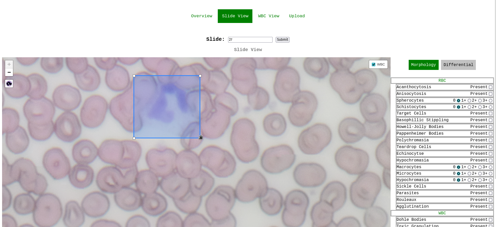
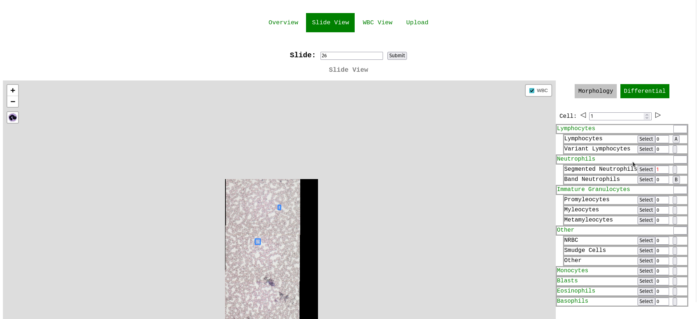
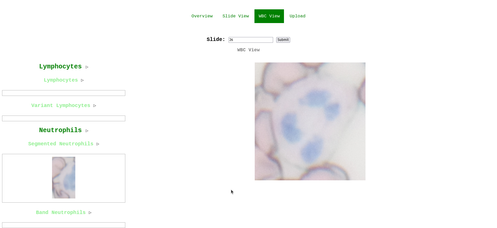
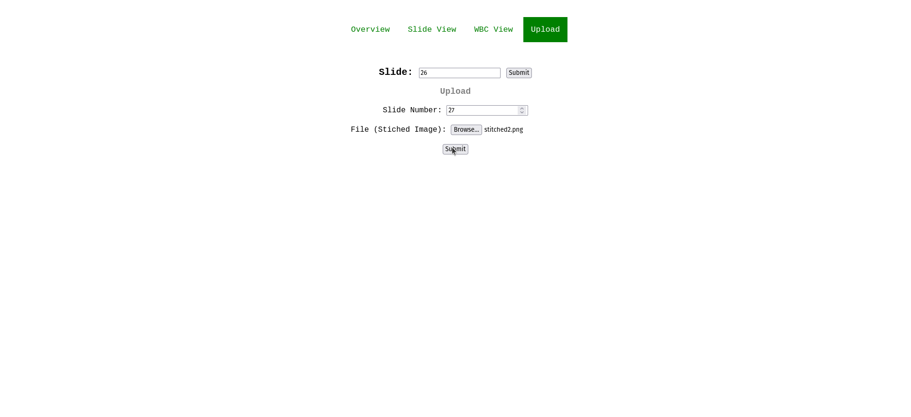

# BLOOD SCAN - Differential and Morphology Analysis

##### Features:
-Slide scan tiling \
-YOLOv8 WBC finder \
-Manual WBC typing \
-Manual morphology \
-Designed with tiled images from openflexure microscope \
-Leaflet based slide viewer

##### Uncompleted Features:
-Removing duplicate WBC counting across tile borders \
-Editing WBC bounds \
-Selecting new WBCs across tile borders \
-Preventing multiple selections on a single WBC

##### Run with:
python3 manage.py makemigrations \
python3 manage.py migrate \
python3 manage.py runserver \
\
python3 manage.py loaddata default_config to get default differential and morphology configs

##### Set custom differential and morphology config:
-open db.sqlite3 \
-open slide_analyzer_morphologyconfig or slide_analyzer_wbcdiffconfig tables \
-Add the type and parent(category) the type is in \
-For RBC morphology if quantitative value of 0 is selected it will be graded as present or not present if 1 is selected it is graded from 0 to 3

## Controls
### Slide View
-Scroll though wbc using arrows \
-Select new wbc using wbc symbol \
-Delete wbc by double clicking then ctrl clicking the cell box \
-Set key for differential count by clicking the button next to the cell count then pressing a key \
-Select morphology findings using check boxes
### WBC View
-Drag WBC image into appropriate category
### Upload
-Upload images by writing a new slide number and selecting a stitched slide scan image

## Demo Images

